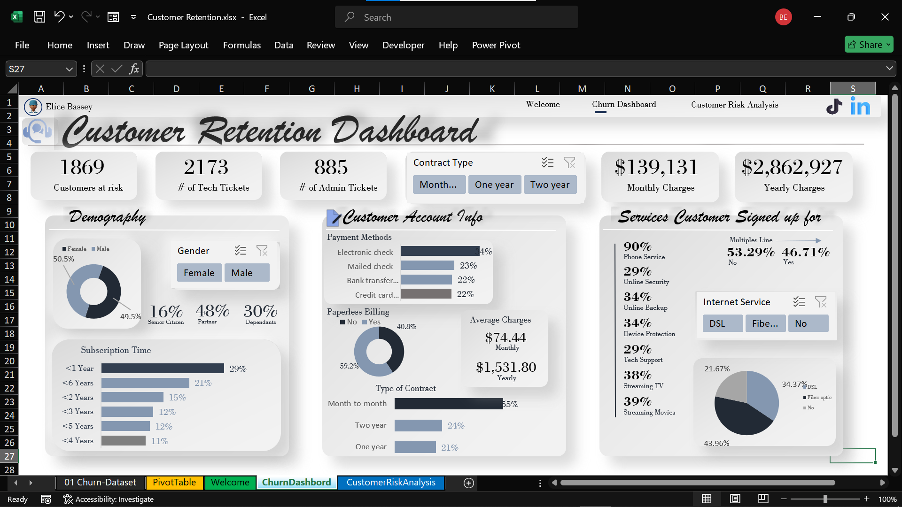

<!--Section 1: Introduce your self-->
## ABOUT ME
Hi! I'm Elisha Bassey😎

_Data Analyst || Uncovering Insights to Drive Growth_

I'm passionate about helping organizations make informed decisions with data-driven solutions.

<!--Mention your top/relevant skills here - core and soft skills-->
### SKILLS

*As a Data Analyst at RespTechHR, I have expertise in the following.*

**- ✅ - Microsoft Excel (advanced formulas, pivot tables, dashboards)

**- ✅ - SQL (querying, data modeling)

**- ✅ - Power BI (data visualization, reporting) 

**- ✅- Python (data manipulation, analysis)

<!--Section 2: List 3-4 key projects-->
## MY PORTFOLIO 

*A glimpse of some of the projects I've been working on.*

**Customer Rentention and Risk Analysis.**

<a href="Customer Retention and risk analysis.pdf">Download the Report here (pdf file)</a>

In today’s competitive business landscape, customer retention is a critical component of any successful growth strategy. Acquiring new customers can be costly, more expensive than retaining existing ones.

[Read More](https://www.linkedin.com/pulse/predictive-modeling-hypothesis-testing-using-titanic-dataset-anietie/)

**Predictive Modeling and Hypothesis Testing using Titanic Dataset.**

On April 15, 1912, during her maiden voyage, the widely considered “unsinkable” RMS Titanic sank after colliding with an iceberg. 

[Read More](https://www.linkedin.com/pulse/predictive-modeling-hypothesis-testing-using-titanic-dataset-anietie/)

**Predictive Modeling and Hypothesis Testing using Titanic Dataset.**

Unfortunately, there weren’t enough lifeboats for everyone onboard, resulting in the death of 1502 out of 2224 passengers and crew. 

<a href="17 How to Present Data to Executives by Anietie Etuk.pdf">Download the Report here (pdf file)</a>

## CONTACT DETAILS

*Let’s connect and see how we can make a difference together!*
<table>
  <tbody>
    <tr>
      <td>📧</td>
      <td><a href="mailto:basseyelisha99@gmail.com">basseyelisha99@gmail.com</a></td>
    </tr>
    <tr>
      <td>📞</td>
      <td>(234) 813-006-5610</td>
    </tr>
    <tr>
      <td>📍</td>
      <td>Abuja, Nigeria</td>
    </tr>
    <tr>
      <td>⬇️</td>
      <td><a href="https://etuk123456.github.io/portfolio1/docs/Profile.pdf">Download my CV</a></td>
    </tr>
    <tr>
      <td>🌐</td>
      <td><a href="https://linkedin.com/in/etukanietie">The things I do daily on LinkedIn</a></td>
    </tr>
    <tr>
      <td>📺</td>
      <td><a href="https://www.youtube.com/@LearnwithEtuk">Watch my tutorials on YouTube</a></td>
    </tr>
  </tbody>
</table>

   

Raw File by Anietie Etuk.txt
Displaying Raw File by Anietie Etuk.txt.
